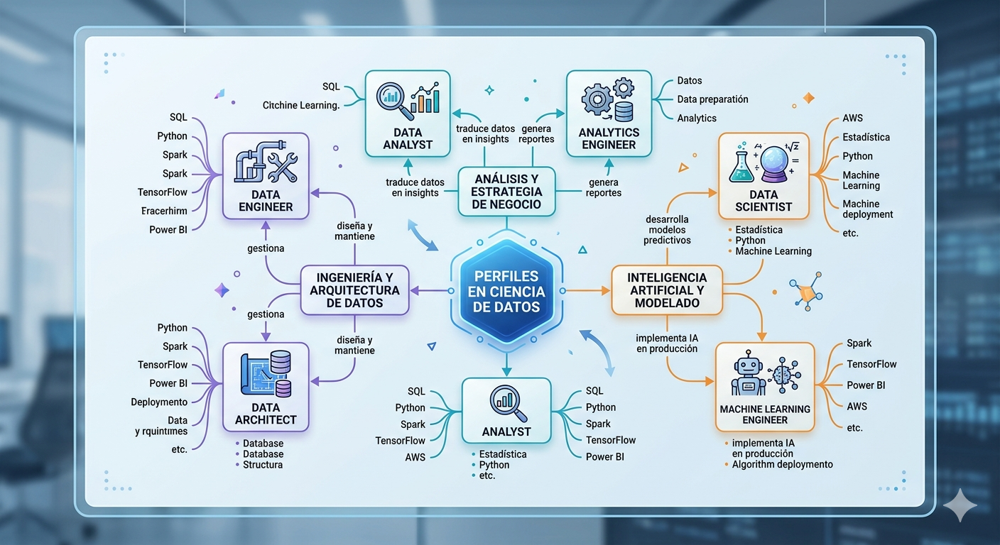

# Investigación de Conceptos Fundamentales
---
## ¿Qué es la ciencia de datos?
La ciencia de datos es una disciplina que combina conocimientos de estadística, programación y análisis para obtener información útil a partir de grandes cantidades de datos.

Su objetivo principal es extraer conocimiento, identificar patrones y apoyar la toma de decisiones mediante el análisis de datos estructurados y no estructurados.

### Componentes principales de la ciencia de datos
La ciencia de datos se basa en 3 componentes fundamentales:

* **Estadística y Matemáticas**
     - Permite analizar e identificar los datos.
     - Ayuda a encontrar patrones, tendencias y relaciones.
     - Incluye conceptos como probabilidad, regresión y análisis descriptivo.
* **Programación y Computación**
    - Se utilizan lenguajes como `Python`, `R` o `SQL`.
    - Sirve para manejar grandes volúmenes de datos y automatizar procesos.
    - Permite crear modelos y algoritmos.
* **Conocimiento del dominio**
    - Es entender el área donde se aplican los datos (salud, finanzas, deportes, etc.).
    - Ayuda a interpretar correctamente los resultados.
    - Permite tomar decisiones útiles y reales.
---

## Diferencia entre datos estructurados y no estructurados

### Datos estructurados
Son aquellos datos que están organizados en un formato definido, normalmente en filas y columnas (como tablas).

Ejemplos: 

* Tablas de Excel.
* Bases de datos SQL.
* Registros de clientes 

### Datos no estructurados
Son datos que no tienen un formato definido ni organizado.

Ejemplos: 

* Imágenes
* Videos 
* Audios
* Publicaciones en redes sociales
* Correos electrónicos

### Diferencias clave
|   Datos estructurados     |   Datos no estructurados      |
|---------------------------|-------------------------------|
| Tiene formato definido    | No tiene formato fijo         |
| Faciles de analizar       | Más complejos de analizar     |

---
## 5 V De Big Data
Las 5 V del Big Data son un conjunto de características que permiten definir, entender y analizar los datos masivos que se generan hoy en día.

Este concepto se utiliza para explicar por qué el Big Data no solo se trata de tener muchos datos, sino también de cómo se generan, qué tipo de datos son, qué tan confiables son y qué utilidad tienen.

Estas dimensiones son fundamentales porque:
* Permiten diseñar mejores sistemas de almacenamiento y análisis.
* Ayudan a las empresas a tomar decisiones más informadas.
* Explican la complejidad del manejo de datos en la actualidad.

Las 5 V son: 
* **Volumen**: cantidad de datos
* **Velocidad**: rapidez con la que se generan y procesan
* **Variedad**: diferentes tipos de datos
* **Veracidad**: calidad y confiabilidad
* **Valor**: utilidad para la toma de decisiones

``` markdown
### 1. Volumen 
Se refiere a la gran cantidad de datos que se generan y almacenan.

Ejemplo:
* Las redes sociales como Facebook o TikTok generan millones de publicaciones, fotos y videos diarios.

### 2. Velocidad
Es la rapidez con la que los datos se generan, procesan y analizan.

Ejemplo:
* Las aplicaciones de navegación como Google Maps procesan datos en tiempo real para mostrar el tráfico.

### 3. Variedad
Hace referencia a los diferentes tipos de datos que existen.

Ejemplo:
* Una empresa puede manejar textos (emails), imágenes (fotos), videos y datos numéricos al mismo tiempo.

### 4. Veracidad
Se refiere a la calidad y confiabilidad de los datos.

Ejemplo:
* Comentarios falsos o spam en redes sociales pueden afectar el análisis si no se filtran.

### 5. Valor 
Es la capacidad de los datos para generar beneficios o información útil.

Ejemplo: 
* Una tienda en línea analiza compras para recomendar productos y aumentar ventas.
```
## Mapa conceptual

*Imagen generada con inteligencia artificial (Google Gemini, 2026), utilizada con fines educativos.*
