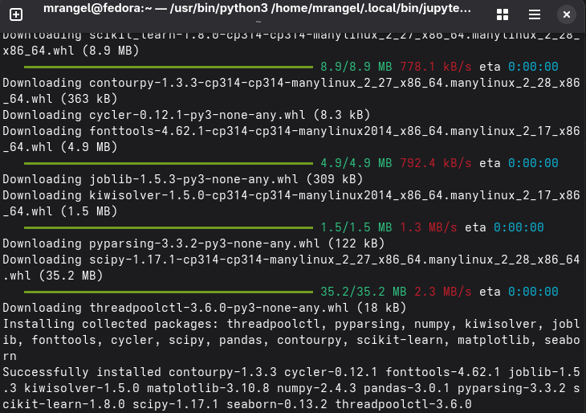

# Configuración del Entorno de Trabajo
---
## Instalación de librerias importantes


## Scrip básico de comprobación
```python
import numpy as np
import pandas as pd
import matplotlib.pyplot as plt
import seaborn as sns
from sklearn.linear_model import LinearRegression

print("Todas las librerías funcionan correctamente :D")
```
## Salida esperada 
```
Todas las librerías funcionan correctamente :D
```
## Ejemplo de carga de datos
```py
import pandas as pd

# Crear datos de ejemplo
datos = {
    "Nombre": ["Ana", "Luis", "Carlos"],
    "Edad": [23, 25, 22]
}

df = pd.DataFrame(datos)

print(df)
```
## Salida esperada
```
   Nombre  Edad
0     Ana    23
1    Luis    25
2  Carlos    22
```