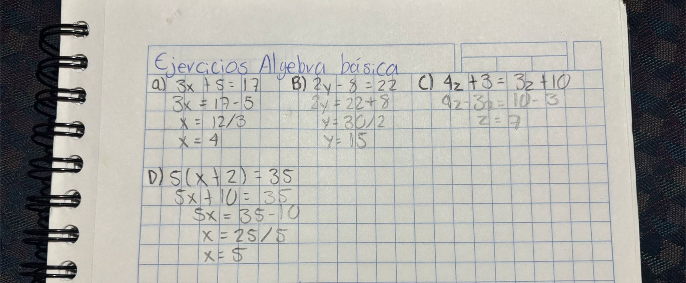
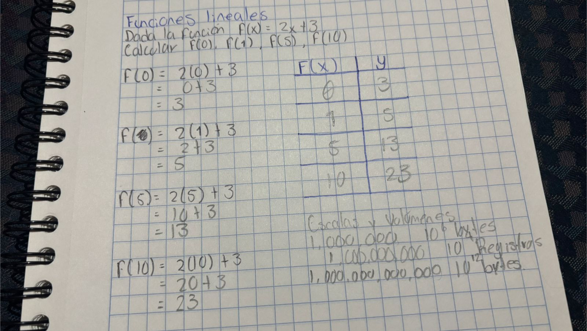
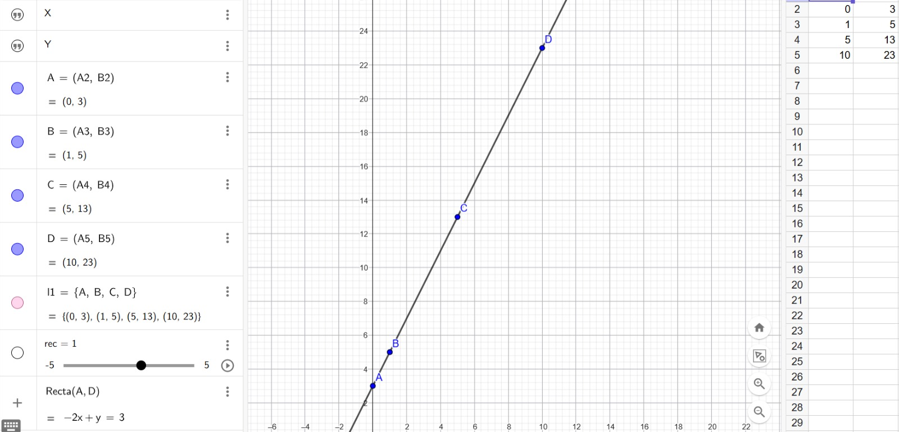
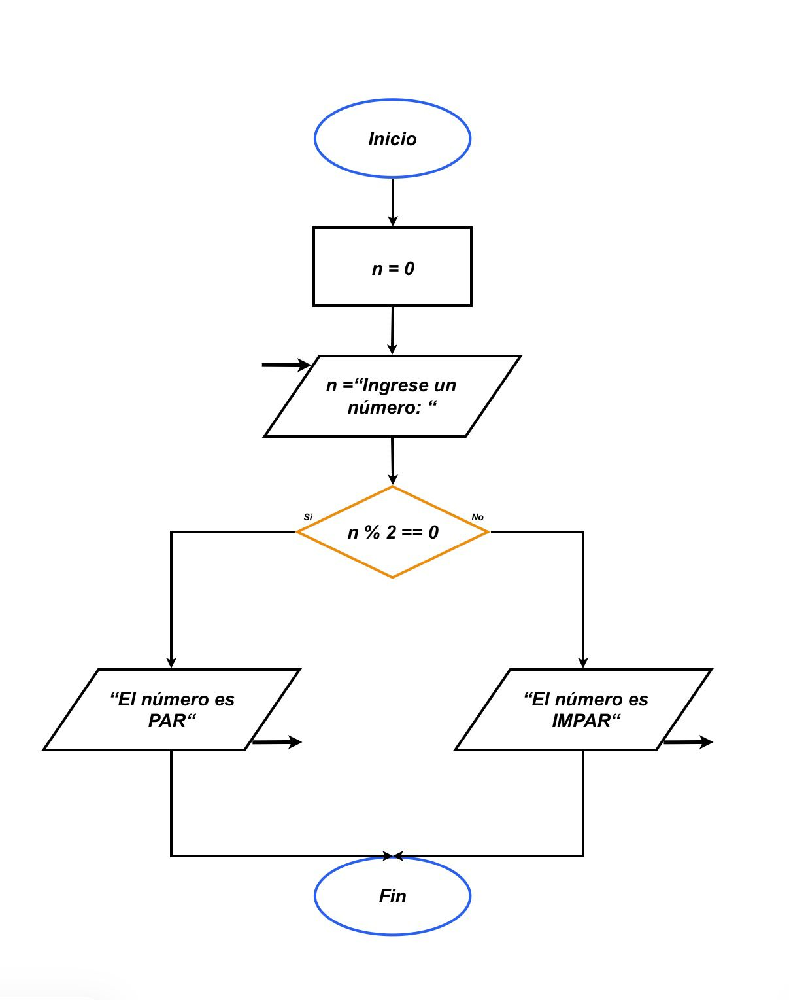
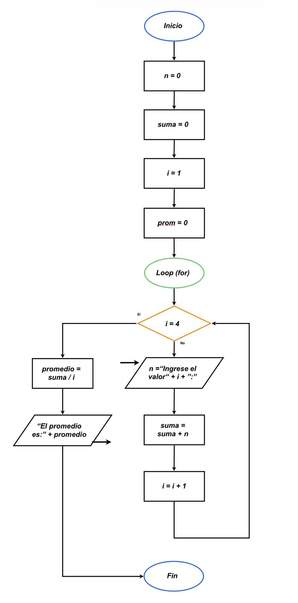
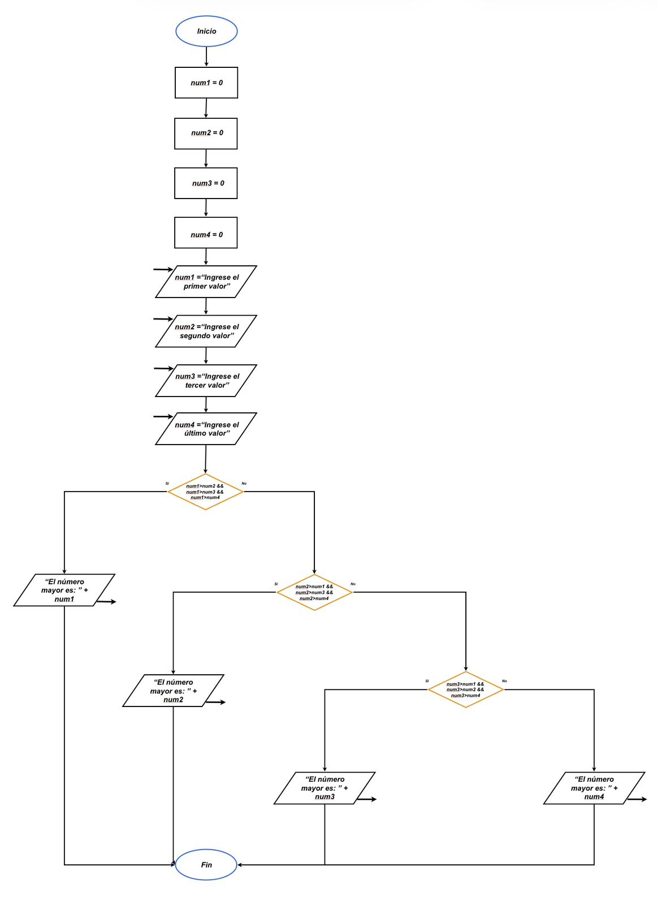

# Semana 1: Fundamentos de Ciencia de Datos y Big Data

## 1. Ejercicios Complementarios

### Ejercicio 1: [Operaciones Algebraicas Básicas]
**Solución:**



### Ejercicio 2: [Funciones Lineales]
**Solución:**





### Ejercicio 3: [Escalas y Volúmenes (Big Data)]
**Solución:**

| Cantidad                    | Notación Científica |
| --------------------------- | ------------------- |
| 1,000,000 bytes             |   10⁶ bytes         |
| 1,000,000,000 registros     |   10⁹ registros     |
| 1,000,000,000,000 bytes     |  10¹² bytes         |

### Ejercicio 4: [Diagramas de Flujo]
**Solución:**

### 1. Determinar si un número es par o impar



### 2. Calcular el promedio de 3 números



### 3. Encontrar el mayor de 4 números



### Ejercicio 5: [Pseudocódigo]
**Solución:**

### 1. Calcular el factorial de un número
```txt
Inicio

    Escribir "Ingrese el número del cual desea factorial:"
    Leer n

    factorial ← 1

    Para i ← n Hasta 1 Con Paso -1 Hacer
        factorial ← factorial * i
        Escribir i
    Fin Para

    Escribir "El factorial es: ", factorial

Fin
```

### 2. Buscar un elemento en una lista
```txt
Inicio

    Definir alumnos como diccionario

    alumnos ← {
        "AL07179280": {Nombre: "Mateo", Apellido: "Reyes", Materia: "Ciencia de datos"},
        "AL07189381": {Nombre: "Sara", Apellido: "Reyes", Materia: "Probabilidad"},
        "AL07199483": {Nombre: "Salvador", Apellido: "Olvera", Materia: "Ingles V"}
    }

    Escribir "Lista de Alumnos:"

    Para cada matricula, datos en alumnos Hacer
        Escribir "Matrícula: ", matricula
        Escribir "Nombre: ", datos.Nombre
        Escribir "Apellido: ", datos.Apellido
        Escribir "Materia Inscrita: ", datos.Materia
    Fin Para

    Escribir "Ingrese la Matrícula del Estudiante:"
    Leer consulta

    Si consulta existe en alumnos Entonces
        alumno ← alumnos[consulta]

        Escribir "Alumno encontrado:"
        Escribir "Nombre: ", alumno.Nombre
        Escribir "Apellido: ", alumno.Apellido
        Escribir "Materia Inscrita: ", alumno.Materia
    Sino
        Escribir "No se encontró la matrícula"
    Fin Si

Fin
```

### 3. Ordenar una lista de números
```txt
Inicio

    Definir numeros como lista vacía

    Escribir "¿Cuántos números desea ingresar?"
    Leer n

    Para i ← 1 Hasta n Hacer
        Escribir "Ingrese el valor ", i
        Leer valor
        Agregar valor a numeros
    Fin Para

    Ordenar numeros de mayor a menor

    Escribir "Lista de números ordenada de mayor a menor:"
    Escribir numeros

Fin
```

### Ejercicio 6: [Operaciones Booleanas]
**Solución:**
```py
a = True
b = False
c = True

print(a and b)      
print(a or b)      
print(not b)       
print(a and c)     
print((a or b) and c)  
```

Salida esperada:
```
False
True
True
True
True
```

### Ejercicio 7: [Historia de la Ciencia de Datos]
**Solución:**
### 1. ¿Quién es considerada la primera científica de datos?
Ada Lovelace (1815–1852) es considerada la primera científica de datos debido a su visión innovadora sobre el uso de las máquinas para procesar información. Matemática y escritora británica, trabajó junto a Charles Babbage, creador de la máquina analítica, un dispositivo que sentó las bases de las computadoras modernas.

Lo que distingue a Ada Lovelace es que fue la primera persona en comprender que una máquina no solo podía realizar cálculos matemáticos, sino también procesar distintos tipos de información. Propuso que los datos podían representar no solo números, sino también elementos como música, texto o imágenes. Entre sus aportaciones más importantes se encuentra la creación del primer algoritmo diseñado para ser ejecutado por una máquina, específicamente para calcular los números de Bernoulli. Por este motivo, también es reconocida como la primera programadora de la historia.

Asimismo, sus notas sobre la máquina analítica ampliaron de manera significativa el trabajo original de Babbage, aportando ideas que en su momento fueron revolucionarias. En ellas, Lovelace describió cómo una máquina podría seguir instrucciones para realizar tareas complejas, lo que hoy en día es la base del funcionamiento de los programas informáticos.

### 2. ¿Qué es el "Data Science Venn Diagram" de Drew Conway?
El Data Science Venn Diagram es un modelo propuesto por Drew Conway en 2010 que explica de manera sencilla las habilidades necesarias para desempeñarse en la ciencia de datos. Este diagrama muestra que esta disciplina surge de la combinación de tres áreas fundamentales: las habilidades de programación (hacking skills), las matemáticas y la estadística, y el conocimiento del área o contexto en el que se trabaja.

La intersección de estas tres áreas representa a un verdadero científico de datos, ya que no es suficiente dominar solo una o dos de ellas. Es necesario integrar las tres para poder analizar información de manera correcta, interpretar resultados y resolver problemas reales. Además, el modelo también advierte sobre la llamada “zona de peligro”, que ocurre cuando se combinan la programación y el conocimiento del área sin una base en estadística, lo que puede llevar a conclusiones erróneas.

En conclusión, este diagrama es importante porque muestra que la ciencia de datos es una disciplina interdisciplinaria que requiere un equilibrio entre habilidades técnicas, analíticas y de comprensión del contexto para poder tomar decisiones informadas a partir de los datos.

### 3. Menciona 3 herramientas modernas de Big Data
`Apache Hadoop:`
Apache Hadoop es una herramienta que permite almacenar y procesar grandes volúmenes de datos en varias computadoras al mismo tiempo.
Se utiliza principalmente para manejar datos masivos de forma distribuida.
Una red social puede usar Hadoop para guardar millones de publicaciones, fotos y comentarios de usuarios sin saturar un solo servidor.

`Apache Spark:`
Apache Spark es un motor que permite analizar datos de forma muy rápida, incluso en tiempo real.
Se usa para procesamiento veloz y tareas como análisis y machine learning.
Aplicaciones como Uber o plataformas de streaming pueden usar Spark para analizar datos al instante, como calcular rutas más rápidas o recomendar contenido.

`Google BigQuery`
Google BigQuery es una herramienta en la nube que permite analizar grandes cantidades de datos usando consultas SQL sin necesidad de servidores propios.
Se usa para análisis rápido y escalable en la nube.
Una empresa puede analizar las ventas de todo el año en segundos para saber qué productos se venden más y tomar decisiones de negocio.

### Ejercicio 8: [Aplicaciones de Big Data]
**Solución:**

*Salud:*

En el sector salud, el Big Data se utiliza para mejorar diagnósticos y tratamientos médicos mediante el análisis de grandes volúmenes de información clínica. Un caso real es el uso de sistemas de inteligencia artificial que analizan imágenes médicas (como radiografías o resonancias) para detectar enfermedades como el cáncer de manera más rápida y precisa

*Finanzas:*

En el ámbito financiero, el Big Data se emplea principalmente para la detección de fraudes y análisis de riesgos. Un ejemplo claro es el uso de algoritmos que analizan millones de transacciones en tiempo real para identificar actividades sospechosas, como compras inusuales o movimientos fuera de lo normal. Los bancos también utilizan estos datos para evaluar la capacidad crediticia de los clientes y tomar decisiones más seguras al otorgar préstamos.

*Redes sociales:*

Las redes sociales utilizan Big Data para personalizar el contenido que ven los usuarios. Plataformas como Facebook o Instagram analizan datos como likes, comentarios, tiempo de visualización y preferencias para mostrar publicaciones relevantes. Esto mejora la experiencia del usuario y aumenta la interacción dentro de la plataforma

*Deportes:*

En el deporte, el Big Data se utiliza para analizar el rendimiento de los atletas y mejorar estrategias de juego. Por ejemplo, los equipos de fútbol recopilan datos sobre velocidad, distancia recorrida y desempeño de los jugadores durante los partidos y entrenamientos. Con esta información, los entrenadores pueden tomar decisiones más precisas, prevenir lesiones y optimizar el rendimiento del equipo.

---

## 2. Actividades Prácticas

### Actividad 1.1: [Conceptos Fundamentales]
**Entregable:** [Actividad1-1.md](Actividades/Actividad1.1/Actividad1-1.md)

### Actividad 1.2: [Casos de Uso]
**Entregable:** [Actividad1-2.md](Actividades/Actividad1.2/Actividad1-2.md)

### Actividad 1.3: [Entorno de Trabajo]
**Entregable:** [Actividad1-3.md](Actividades/Actividad1.3/Actividad1-3.md)

### Actividad 1.4: [Fuentes de Datos]
**Entregable:** [Actividad1-4.md](Actividades/Actividad1.4/Actividad1-4.md)

## 3. Resumen de Aprendizaje

* Retomar nuevamente operaciones básicas de algebra
* Comprender como varios sectores utilizan Big Data y que problemáticas resuelven 
* Volver a ver conceptos básicos de programación (Diagramas de flujo, Pseudocódigo, Lenguajes de programación)
* Funcionalidad de los Datasets
* DIferencia entre Datos estructurados y No estructurados

## 4. Dudas o Preguntas

- ¿Nos adentraremos más en JSON?
- ¿Para qué sirve lo de Jupyter?

## 5. Referencias

* IBM. https://www.ibm.com/topics/data-science
* Oracle. https://www.oracle.com/data-science/
* Kaggle. https://www.kaggle.com
* Dataset utilizados: 
    - https://www.kaggle.com/datasets/tmdb/tmdb-movie-metadata
    - https://www.kaggle.com/competitions/dogs-vs-cats
    - https://www.kaggle.com/competitions/house-prices-advanced-regression-techniques
