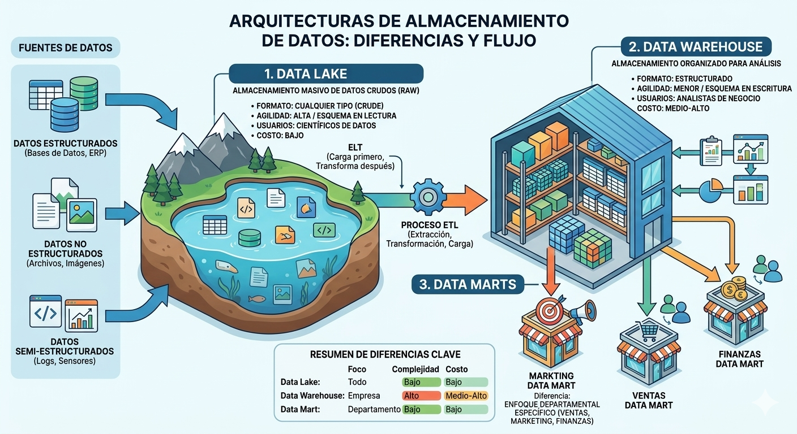

# Investigación de Arquitecturas de Datos
--- 
## ¿Qué son los Data Warehouses?

Es un sistema diseñado para el análisis y la elaboración de informes. Imaginalo como una biblioteca perfectamente organizada.

* Estado de los datos: Almacena datos estructurados que ya han sido procesados para un propósito específico.

* Uso principal: Soporte para la toma de decisiones empresariales y Business Intelligence (BI).

* Proceso (ETL): Los datos pasan por un proceso de Extracción, Transformación y Carga antes de entrar al almacén.

## ¿Qué son los Data Lakes

Es un repositorio centralizado que permite almacenar todos tus datos, estructurados y no estructurados, a cualquier escala. Imaginalo como un cuerpo de agua en estado natural.

* Estado de los datos: Almacena datos en su formato original (raw data), desde archivos de texto y logs hasta imágenes o videos, sin necesidad de estructurarlos primero.

* Uso principal: Científicos de datos, Machine Learning y análisis predictivo donde se necesita el dato "puro".

* Proceso (ELT): Aquí se cargan primero los datos y se transforman solo cuando es necesario leerlos o analizarlos.

## Comparativa de Características: Data Warehouse vs. Data Lake

| *Características* | *Data Warehouses*                                               | *Data Lake*                                                          |
|-------------------|-----------------------------------------------------------------|----------------------------------------------------------------------|
| *Datos*           | Estructurados (Tablas, esquemas definidos).| Análisis           | Estructurados, semi-estructurados y no estructurados (Raw).          |
| *Esquemas*        | Schema-on-write: El diseño se define antes de guardar los datos.| Schema-on-read: El diseño se define al momento de consultar el dato. |
| *Agilidad*        | Menos flexible; los cambios en la estructura son costosos.      | Altamente flexible; se adapta rápido a nuevos tipos de datos.        |
| *Usuarios*        | Analistas de negocio, usuarios de BI.                           | Científicos de datos, Ingenieros de datos.                           |
| *Costo*           | Generalmente más alto debido al procesamiento previo.           | Más económico (almacenamiento de bajo costo para grandes volúmenes). |
| *Procesamiento*   | ETL (Extract, Transform, Load).                                 | ELT (Extract, Load, Transform).                                      |

### Justificación
* Velocidad de Respuesta: El Data Warehouse gana en rapidez para reportes operativos porque los datos ya están limpios.

* Profundidad de Análisis: El Data Lake es superior para experimentos de Inteligencia Artificial, ya que conservar los datos originales (sin filtros) permite descubrir patrones que un proceso de limpieza previo podría haber eliminado.

* Gobernanza: Es mucho más sencillo aplicar reglas de seguridad y cumplimiento en un Warehouse debido a su estructura rígida, mientras que el Lake requiere herramientas adicionales para evitar que se convierta en un "pantano de datos" (Data Swamp).

## ¿Qué es un Data Mart?

Un Data Mart es una versión enfocada y especializada de un Data Warehouse. Si el Data Warehouse es la biblioteca central de toda la empresa, el Data Mart es el estante especializado de un departamento en particular (como Ventas, Marketing o Finanzas).

### Caracterśticas principales
```md
* **Enfoque Específico:** Solo contiene datos relevantes para un grupo de usuarios o un área de negocio específica.

* **Rapidez:** Al manejar menos volumen de datos que un Warehouse completo, las consultas y el acceso a la información son mucho más rápidos.

* **Costo y Tiempo:** Son más sencillos y económicos de implementar porque tienen un alcance limitado.

* **Fuente de Datos:** Puede obtener su información del Data Warehouse central (Data Mart dependiente) o directamente de sistemas operativos (Data Mart independiente).
```
### Justificación

La razón principal para crear un Data Mart es la eficiencia operativa. Un equipo de Marketing no necesita navegar por millones de registros de nómina o logística; solo necesitan sus métricas de campañas. Al segmentar la información, se reduce la complejidad y se mejora la seguridad, ya que cada departamento accede solo a lo que le corresponde.

## Diagrama 

*Imagen generada con inteligencia artificial (Google Gemini, 2026), utilizada con fines educativos.*

