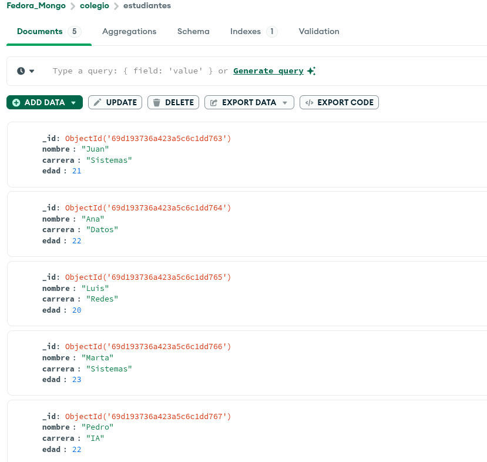

# Introducción a MongoDB

## Instalación 

> 1. Primero ponemos este bloque de código en nuestra terminal
```bash
cat <<EOF | sudo tee /etc/yum.repos.repos.d/mongodb-org-7.0.repo
[mongodb-org-7.0]
name=MongoDB Repository
baseurl=https://repo.mongodb.org/yum/redhat/9/mongodb-org/7.0/x86_64/
gpgcheck=1
enabled=1
gpgkey=https://pgp.mongodb.com/server-7.0.asc
EOF
```

> 2. Instalación de los Paquetes
```bash
sudo dnf install -y mongodb-org
```

>3. Inciar el servidor
* Para iniciar el servidor:
    * ```bash
        sudo systemctl start mongod 
        ```

* Para que inicie automáticamente cada vez que prendas tu laptop:
    * ```bash
        sudo systemctl enable mongod
        ```

## Instalación de MongoDB Compass en Fedora

> 1. Descarga el paquete:
```bash
wget https://downloads.mongodb.com/compass/mongodb-compass-1.42.2.x86_64.rpm
```

> 2. Instala el archivo:
```bash
sudo dnf install -y ./mongodb-compass-1.42.2.x86_64.rpm
```

## Dentro de MongoDB Compass

* *1. Primero creamos nuestra base de datos junto con nuestra colección*
* *2. Agregamos los 5 documentos*
* *3. Resultado final:*
    * 


